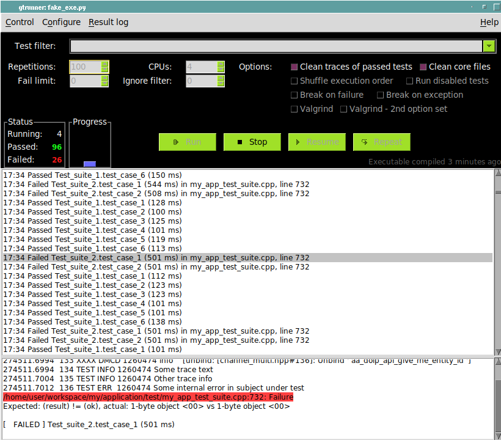

# GtestGui

GtestGui is a full-featured graphical user-interface to test applications using
the [GoogleTest framework](https://google.github.io/googletest/).

GtestGui was created mainly for removing the need for fiddling with Gtest
command line options, for tracking the status of long-running test campaigns
and for extracting individual test cases' traces from large trace output
files.

The GoogleTest framework is widely known for its C++ Unit-Testing support
via the [GMock](https://google.github.io/googletest/reference/mocking.html)
feature. But one can also use just the
[test framework](https://google.github.io/googletest/reference/testing.html)
for defining test cases, scheduling test executions, and collecting verdicts
and thus encapsulate any kind of test cases. This saves some implementation
effort, but more importantly also has the advantage of presenting a well-known
common interface to developers.

GtestGui is designed especially for component tests, integration tests and
other higher-level testing, where the number of tests is smaller compared to
unit-testing, but individual test cases run longer and tests may have to be run
repeatedly (e.g. when test scenarios are not fully reproducible due to timing
between threads.)

GtestGui supports this by allowing to schedule test cases across multiple CPUs.
For very long-running campaigns, the "clean traces of passed tests" option
allows storing only traces of failed tests to disk. Status of ongoing tests is
presented in form of a top-level pass/fail summary and progress bar, as well as
a running log of test case verdicts, which can be filtered and sorted (e.g. to
show only failed test cases.) Traces of individual test cases are accessible
while the test campaign is still running either in a small preview window below
the test log, or via double-click which exports them to an external trace
browser. ([Trowser](https://github.com/tomzox/trowser) is recommended for this
purpose.)

GtestGui provides access to Gtest command line options directly from the main
window. Most importantly, test case filters can be entered manually, or via
drop-down menu listing all test cases, or the test case list dialog. Other
supported options are the test repetition count, failure limit, shuffling
execution order, running disabled tests and breaking on failure or exceptions.
The latter will on POSIX systems produce a core dump that can be pre-analyzed
via the result log's context menu by extracting stack traces. Finally, an
option allows running tests under valgrind and automatically detecting issues
that were found for the result log.

GtestGui can also be used for analyzing pre-existing trace output files
by adding the trace file names on the command line when starting.



I developed GtestGui for my daily work as a C++ software engineer. (Actually,
it is a re-implementation of a GUI I had designed in C and Tcl/Tk for a
self-written C test framework that predated GoogleTest, which is why I consider
the tool mature despite the apparent young age of this most recent
incarnation.) GtestGui supports me in initial development phases using
test-driven development where I need to run the same sub-set of test cases over
and over again. It supports getting a quick overview of stability across the
complete set of tests and which kind of failures occur.  And it supports final
quality checking in long-running, high-repetition test campaigns, optionally
using valgrind or sanitizer builds.

## Installation

GtestGui is available as package "mote-gtest-gui" ("Module tester's Gtest GUI")
on [PyPi](https://pypi.org/project/mote-gtest-gui/). It can be installed using
pip3:
```console
   pip3 install mote-gtest-gui
```

Python3 and the Python "tkinter" module are required. (The latter usually is
part of default Python installation.)

## Usage

Packages are not yet provided. To use the software, clone the repository and
then run `gtest_gui.py`, located in the top-level directory. For integration
with the [Trowser](https://github.com/tomzox/trowser) trace browser either
place `trowser.py` somewhere in the path, or create a symbolic link to the path
where it is located as `gtest_gui/trowser`.

You can either specify the path of your test application executable file
directly on the command line of `gtest_gui.py`, or select one via a file
browser afterward (see the Control menu).  Alternatively, or additionally, you
can specify one or more trace output files on the command line, which will be
parsed for test case results and loaded into the result list in the GUI.

In summary, most common usage is as follows:
```console
    gtest_gui/gtest_gui.py my_test_application.exe
```

On the MS-Windows platform, start GtestGui via pythonw.exe to avoid getting a
console window.

## Documentation

For a detailed description, please refer to the [manual page](doc/gtest_gui.pod)
